# Basic Paint

Utilizes a three-layer system: base coat, metallic flakes, and a clear top coat.

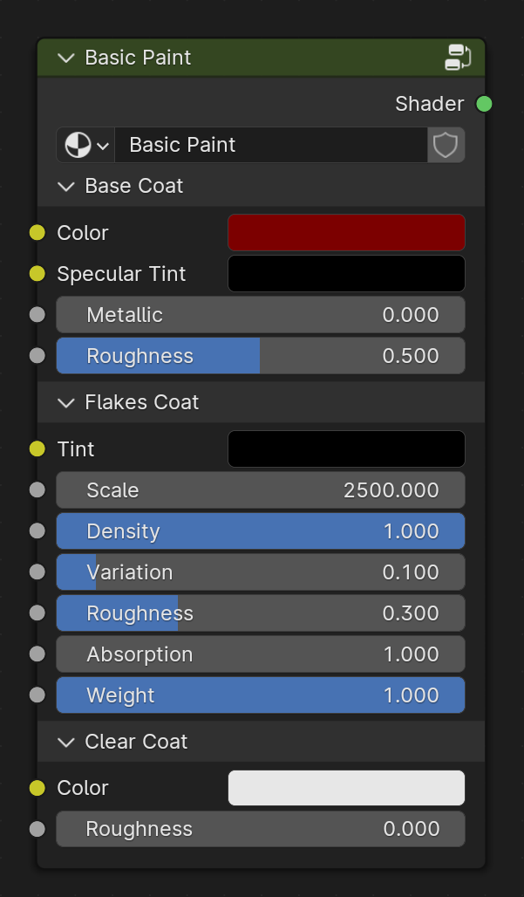

## Inputs

### Base Coat

#### Color
Specifies the base color of the paint.
<figure>
  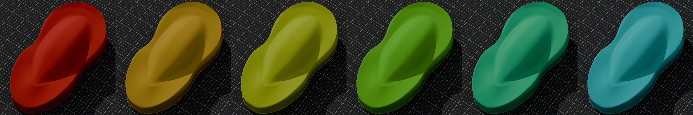
  <figcaption text-align="center">Variation of base colors</figcaption>
</figure>

#### Metallic
Controls the metallic appearance of the base paint coat.
<figure>
  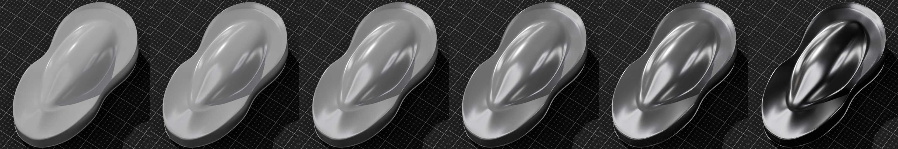
  <figcaption text-align="center">Metallic from 0.0 to 1.0</figcaption>
</figure>

#### Specular Tint
Adjusts the tint of the specular highlights.
<figure>
  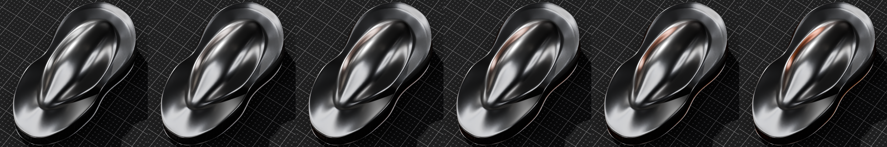
  <figcaption text-align="center">From white to orange</figcaption>
</figure>

#### Roughness
Controls the roughness of the base paint coat.
<figure>
  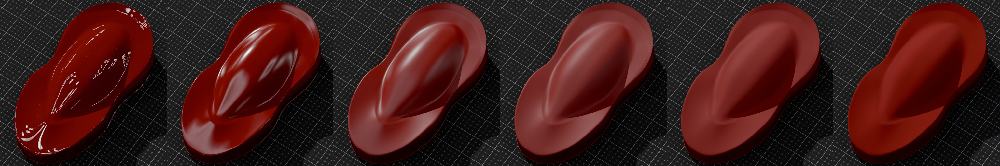
  <figcaption text-align="center">Roughness from 0.0 to 1.0</figcaption>
</figure>

### Flakes Coat

#### Tint

Sets the color of the flakes tint in the paint. Since the flakes are embedded inside the base coat, the color of the base coat will influence the flake tint.
<figure>
  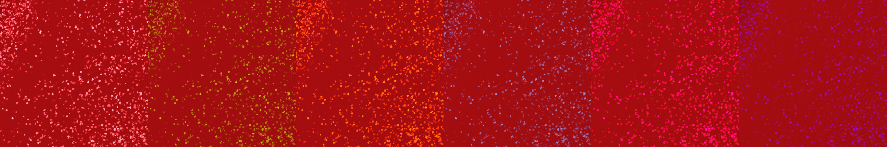
  <figcaption text-align="center">Variation of flake tints</figcaption>
</figure>

#### Scale
Adjusts the size of the flakes.
<figure>
  
  <figcaption text-align="center">Scale from 250.0 to 5000.0</figcaption>
</figure>

#### Density
Controls the density of the flakes.
<figure>
  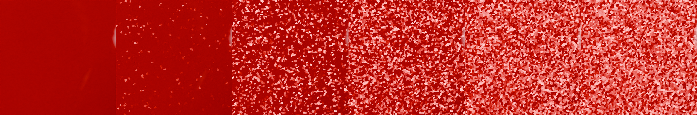
  <figcaption text-align="center">Density from 0.0 to 1.0</figcaption>
</figure>

#### Variation
This parameter determines the extent to which flake orientation deviates from the surface normal. A value of 0.0 means minimal deviation, aligning flakes closely with the surface. Higher values intensify the flake effect, making it more pronounced.
<figure>
  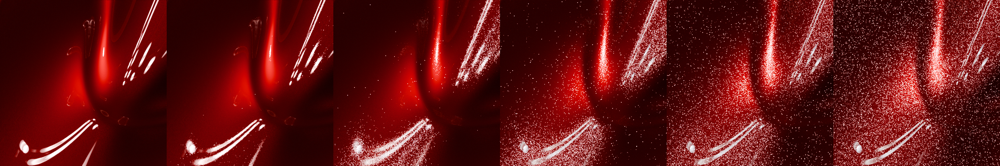
  <figcaption text-align="center">Variation from 0.0 to 0.1</figcaption>
</figure>

#### Roughness
Specifies the roughness of the flakes.
<figure>
  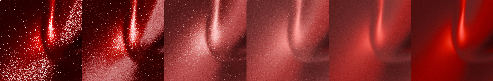
  <figcaption text-align="center">Roughness from 0.0 to 1.0</figcaption>
</figure>

#### Absorption

Specifies the degree of light absorbed by the pigment before it is reflected off the flakes.
<figure>
  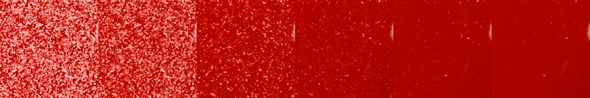
  <figcaption text-align="center">Absorption from 1.0 to 5.0</figcaption>
</figure>

#### Weight
This multiplier scales the reflection intensity received by the flakes.
<figure>
  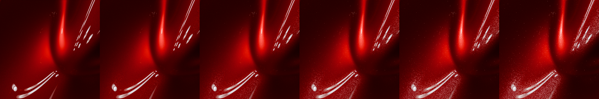
  <figcaption text-align="center">Weight from 0.0 to 1.0</figcaption>
</figure>

### Clear Coat

#### Color
Specifies the color of the clear coat layer.
<figure>
  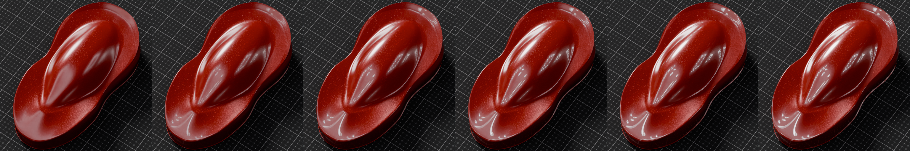
  <figcaption text-align="center">Color from black to white</figcaption>
</figure>

#### Roughness
Controls the roughness of the clear coat layer.
<figure>
  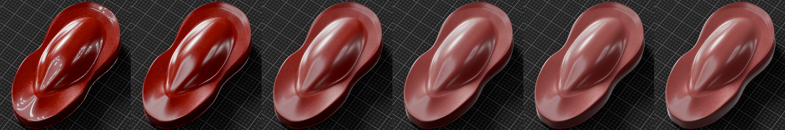
  <figcaption text-align="center">Roughness from 0.0 to 1.0</figcaption>
</figure>

## Outputs

### Shader
Standard shader output.