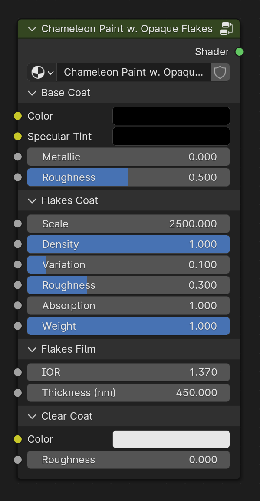
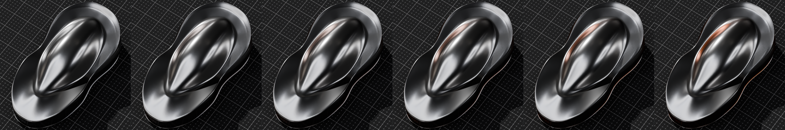
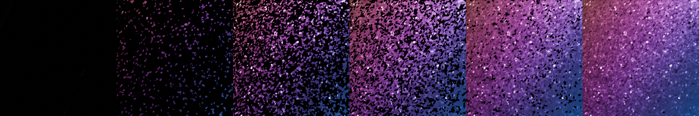
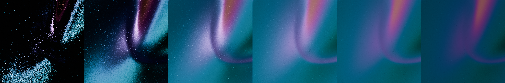
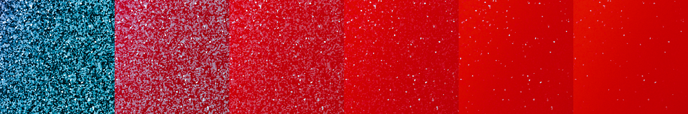
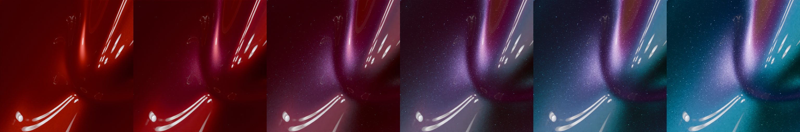

# Chameleon Paint w. Opaque Flakes

Has the same three layers (base coat, metallic flakes, and a clear top coat) where the metallic flakes are coated in a thinfilm.

This shader was designed to simulate ChromaFlair pigments. It's comprised of highly reflective aluminium flakes that are coated with a thin layer of magnesium fluoride, which is embedded in an extremely thin layer of chromium.

## Inputs

### Base Coat

#### Color
Specifies the base color of the paint.
<figure>
  
  <figcaption text-align="center">Variation of base colors</figcaption>
</figure>

#### Metallic
Controls the metallic appearance of the base paint coat.
<figure>
  
  <figcaption text-align="center">Metallic from 0.0 to 1.0</figcaption>
</figure>

#### Specular Tint
Adjusts the tint of the specular highlights.
<figure>
  
  <figcaption text-align="center">From white to orange</figcaption>
</figure>

#### Roughness
Controls the roughness of the base paint coat.
<figure>
  
  <figcaption text-align="center">Roughness from 0.0 to 1.0</figcaption>
</figure>

### Flakes Coat

#### Scale
Adjusts the size of the flakes.
<figure>
  
  <figcaption text-align="center">Scale from 250.0 to 5000.0</figcaption>
</figure>

#### Density
Controls the density of the flakes.
<figure>
  
  <figcaption text-align="center">Density from 0.0 to 1.0</figcaption>
</figure>

#### Variation
This parameter determines the extent to which flake orientation deviates from the surface normal. A value of 0.0 means minimal deviation, aligning flakes closely with the surface. Higher values intensify the flake effect, making it more pronounced.
<figure>
  
  <figcaption text-align="center">Variation from 0.0 to 0.3</figcaption>
</figure>

#### Roughness
Specifies the roughness of the flakes.
<figure>
  
  <figcaption text-align="center">Roughness from 0.0 to 1.0</figcaption>
</figure>

#### Absorption
Specifies the degree of light absorbed by the pigment before it is reflected off the flakes.
<figure>
  
  <figcaption text-align="center">Absorption from 1.0 to 5.0, with a red base coat</figcaption>
</figure>

#### Weight
This multiplier scales the reflection intensity received by the flakes.
<figure>
  
  <figcaption text-align="center">Weight from 0.0 to 1.0</figcaption>
</figure>

### Flakes Film

#### IOR and Thickness

    <figure>
        <video width="100%" height="auto" controls loop>
            <source src="_static/media/flake_opaque_ior/vid.mp4" type="video/mp4">
        </video>
        <figcaption text-align="center">Film IOR from 1.0 to 3.0</figcaption>
    </figure>
    <figure>
        <video width="100%" height="auto" controls loop>
            <source src="_static/media/flake_opaque_thickness/vid.mp4" type="video/mp4">
        </video>
        <figcaption text-align="center">Film thickness from 0.0nm to 800.0nm</figcaption>
    </figure>

### Clear Coat

#### Color
Specifies the color of the clear coat layer.
<figure>
  
  <figcaption text-align="center">Color from black to white</figcaption>
</figure>

#### Roughness
Controls the roughness of the clear coat layer.
<figure>
  
  <figcaption text-align="center">Roughness from 0.0 to 1.0</figcaption>
</figure>

## Outputs

### Shader
Standard shader output.