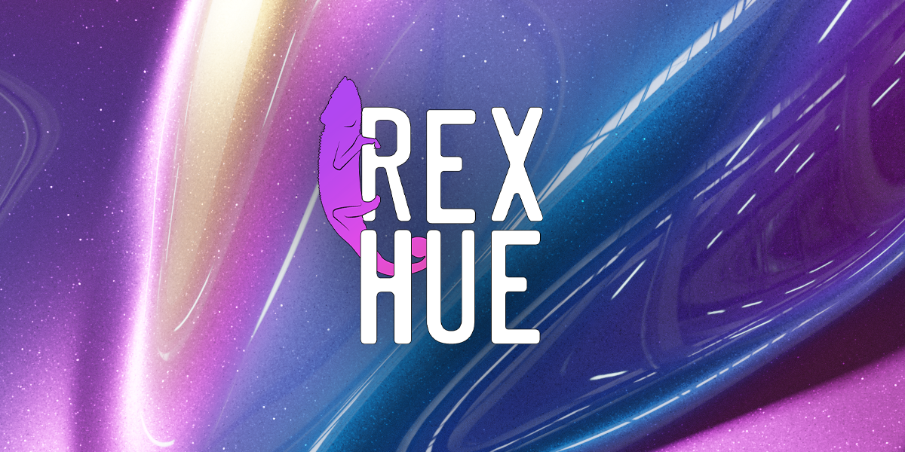

% RexHue documentation master file, created by
% sphinx-quickstart on Wed Mar 22 20:43:34 2023.
% You can adapt this file completely to your liking, but it should at least
% contain the root `toctree` directive.

# The RexHue Asset Library


## Where to Buy

- [GumRoad - 1.99](https://jakekurtz.gumroad.com/l/rexhue)
- [BlenderMarket - 2.99](https://blendermarket.com/products/rexhue)

```{toctree}
:caption: 'Contents:'
:maxdepth: 2

install
materials/index
shaders/index
textures/index

```