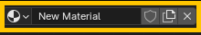
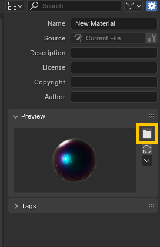

# Installation

## Installing The RexHue Assest Library

- Navigate to the location where **Rexhue Assets.zip** was installed, and extract it to where you keep your assets. For instance: **C:\\Users\\<your_user_name_here>\\Documents\\Blender\\**
- Open Blender
- Open up preferences: **Edit > Preferences**
- Under **File Paths > Asset Libraries**, click the plus button
- Navigate to where you extracted your files in the first step, open the folder, then click **Add Asset Library**
- Click the burger menu icon at the bottom left and select **Save Prefrences**

🎉 **The Rexhue Assest Library is now installed!** 🎉

## Adding Your Own Presets

- Navigate to where you extracted the **Rexhue Assets** folder
- Open the **assets.blend** file
- Select the **speed_shape** object, and set the material to the one you wish to add to the asset library.
- In the **Shader Editor**, right click the active material, and click **Mark as Asset**

- With the new material assigned, and using the render settings already set in the **asset.blend** file, select **Render > Render Image**
- Save the image somewhere inside **Rexhue Assets**
- In the **Asset Browser**, under **Unassigned**, select your new material
- In the **Asset Details Region** select the folder icon to **Load a Custom Preview**

- Select the image you just rendered and click **Load Custom Preview**

🎉 **Your new asset is done!** 🎉