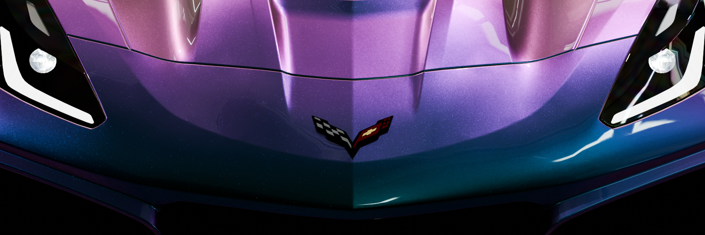

% RexHue documentation master file, created by
% sphinx-quickstart on Wed Mar 22 20:43:34 2023.
% You can adapt this file completely to your liking, but it should at least
% contain the root `toctree` directive.

# Car Paint


A three-layer car paint consists of a base coat that provides the vehicle's primary color, an optional pearlescent or metallic layer that adds depth and sparkle, and finally a clear coat that offers a glossy finish.

```{toctree}
:maxdepth: 1

car_paint
car_paint_flex
car_paint_opaque_flakes
car_paint_transparent_flakes

```