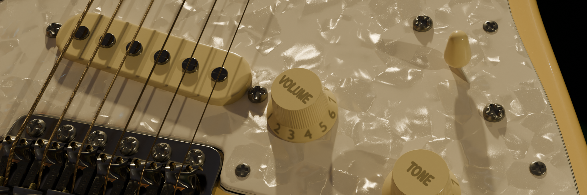

```{note}
This page is under construction.
```

# Pearloid


Pearloid is a type of synthetic material (celluloid plastic) designed to mimic the appearance of mother of pearl. It’s often used in making musical instruments and decorative items, to give a lustrous iridescent finish.

## Inputs

### Base

#### Color
Specifies the base color.
<figure>
  
  <figcaption text-align="center">Variation of base colors</figcaption>
</figure>


#### Roughness
Controls the roughness of the base layer.
<figure>
  
  <figcaption text-align="center">Roughness from 0.0 to 1.0</figcaption>
</figure>


#### Transmission Weight
Controls the Transmission Weight of the base layer.
<figure>
  
  <figcaption text-align="center">Transmission Weight from 0.0 to 1.0</figcaption>
</figure>

#### IOR
Controls the Index of Refraction of the base layer.
<figure>
  
  <figcaption text-align="center">IOR from 1.0 to 4.0</figcaption>
</figure>

### Flakes

#### Weight
This multiplier scales the reflection intensity received by the celluloid flakes.
<figure>
  
  <figcaption text-align="center">Weight from 0.0 to 1.0</figcaption>
</figure>

#### Density
Controls the density of the celluloid flakes.
<figure>
  
  <figcaption text-align="center">Density from 0.0 to 1.0</figcaption>
</figure>

#### Tint
Sets the color of the flakes tint in the paint.
<figure>
  
  <figcaption text-align="center">Variation of flake tints</figcaption>
</figure>

#### Scale
Adjusts the size of the flakes.
<figure>
  
  <figcaption text-align="center">Scale from 3.0 to 60.0</figcaption>
</figure>

#### Randomness
The randomness of the flake shape.
<figure>
  
  <figcaption text-align="center">Randomness from 0.0 to 1.0</figcaption>
</figure>

#### Grain Scale

<figure>
  
  <figcaption text-align="center"></figcaption>
</figure>

#### Roughness
Specifies the roughness of the flakes.
<figure>
  
  <figcaption text-align="center">Roughness from 0.0 to 1.0</figcaption>
</figure>

#### Absorption
Specifies the degree of light absorbed by the pigment before it is reflected off the flakes. 
<figure>
  
  <figcaption text-align="center">Absorption from 0.0 to 2.0<</figcaption>
</figure>

#### Seed

### Flake Depth

#### Intensity
Controls the intensity of the depth seperation between flakes. At 0.0, all flakes have the same depth. At 1.0, flakes will have a large difference in depth. 
<figure>
  
  <figcaption text-align="center">Depth Intensity from 0.0 to 1.0</figcaption>
</figure>

#### Threshold
Controls the depth at which flakes start to appear.
<figure>
  
  <figcaption text-align="center">Depth Threshold from 0.0 to 1.0</figcaption>
</figure>

### Flake Normal

#### Distance
Multiplier for the height value to control the overall distance.
<figure>
  
  <figcaption text-align="center">Normal Distance from 0.0 to 0.64</figcaption>
</figure>

#### Roughness
Controls the normal map roughness. 
<figure>
  
  <figcaption text-align="center">Normal Distance from 0.0 to 1.0</figcaption>
</figure>

#### Variation
This parameter determines the extent to which flake orientation deviates from the surface normal. A value of 0.0 means minimal deviation, aligning flakes closely with the surface. Higher values intensify the flake effect, making it more pronounced.
<figure>
  
  <figcaption text-align="center">Normal Variation from 0.0 to 0.2</figcaption>
</figure>

### Pearlescence

#### Weight
Adjusts the intensity of the pearlescent effect.
<figure>
  
  <figcaption text-align="center">Pearlescence Weight from 0.0 to 1.0</figcaption>
</figure>

#### Thickness (nm)
Controls the thickness (nanometers) of the thinfilm layers.
<figure>
  
  <figcaption text-align="center">Thickness from 450nm to 650nm</figcaption>
</figure>

#### IOR

### Diffraction

#### Weight
Controls the intensity of the diffraction effect.
<figure>
  
  <figcaption text-align="center">Diffraction Weight from 0.0 to 1.0</figcaption>
</figure>

#### Spread
Adjusts the spread of the diffraction effect.
<figure>
  
  <figcaption text-align="center">Diffraction Spread from 0.0 to 10.0</figcaption>
</figure>

#### Tangent
Sets the tangent mapping for diffraction effects. 
<figure>
  
  <figcaption text-align="center">UVmap, Y, Z</figcaption>
</figure>

### Coat

#### Weight

<figure>
  
  <figcaption text-align="center"></figcaption>
</figure>

#### Roughness
Controls the roughness of the clear coat layer.
<figure>
  
  <figcaption text-align="center">Roughness from 0.0 to 1.0</figcaption>
</figure>

#### Tint
Specifies the tint of the clear coat layer.
<figure>
  
  <figcaption text-align="center">Variation of tint colors</figcaption>
</figure>

## Outputs

### Shader
Standard shader output.