# Pearloid

## Inputs

### Base

#### Color

<figure>
  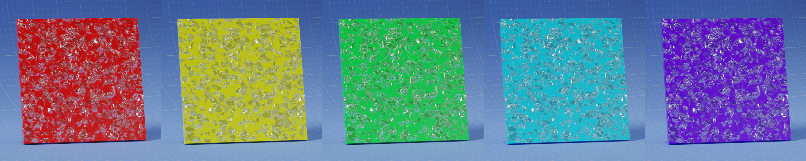
  <figcaption text-align="center"></figcaption>
</figure>

#### Roughness

<figure>
  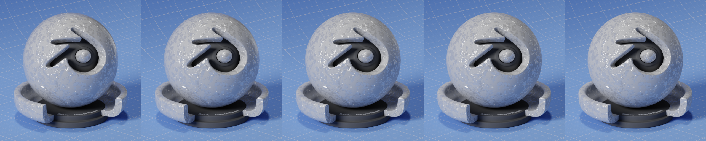
  <figcaption text-align="center"></figcaption>
</figure>

#### Transmission Weight

<figure>
  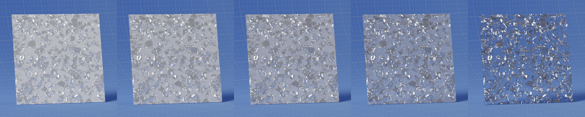
  <figcaption text-align="center"></figcaption>
</figure>

#### IOR

<figure>
  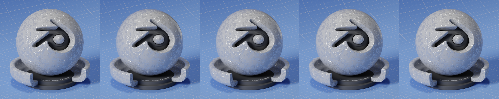
  <figcaption text-align="center"></figcaption>
</figure>

### Flakes

#### Weight

<figure>
  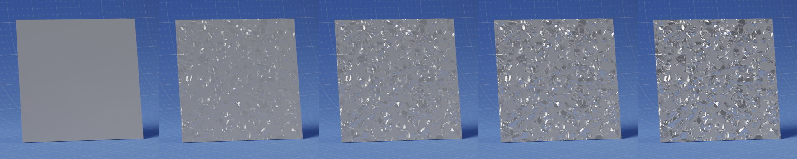
  <figcaption text-align="center"></figcaption>
</figure>

#### Density

<figure>
  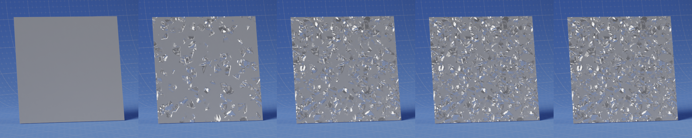
  <figcaption text-align="center"></figcaption>
</figure>

#### Tint

<figure>
  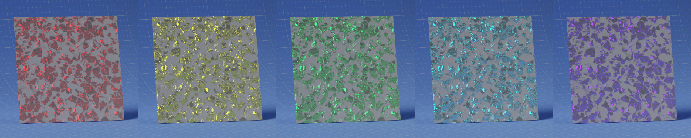
  <figcaption text-align="center"></figcaption>
</figure>

#### Scale

<figure>
  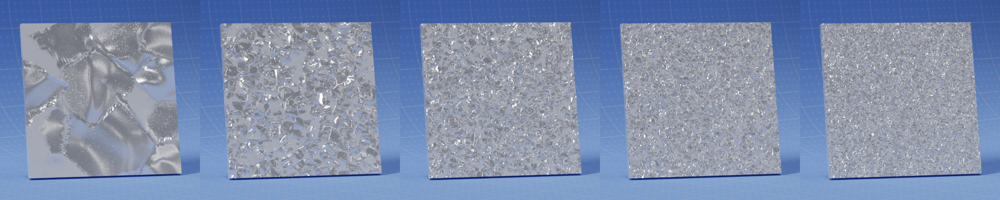
  <figcaption text-align="center"></figcaption>
</figure>

#### Randomness

<figure>
  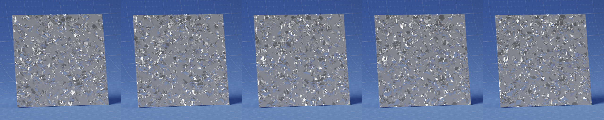
  <figcaption text-align="center"></figcaption>
</figure>

#### Grain Scale

<figure>
  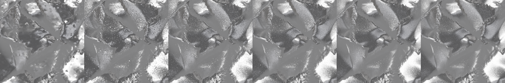
  <figcaption text-align="center"></figcaption>
</figure>

#### Roughness

<figure>
  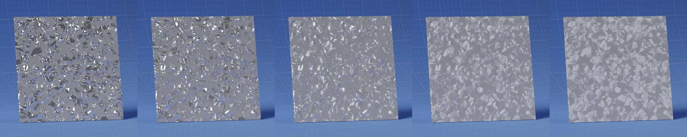
  <figcaption text-align="center"></figcaption>
</figure>

#### Absorption

<figure>
  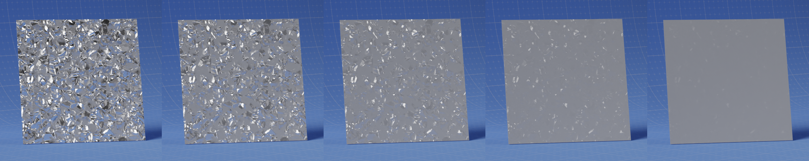
  <figcaption text-align="center"></figcaption>
</figure>

#### Seed

### Flake Depth

#### Intensity

<figure>
  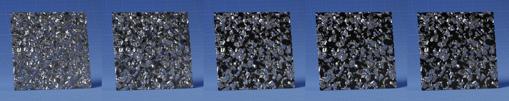
  <figcaption text-align="center"></figcaption>
</figure>

#### Threshold

<figure>
  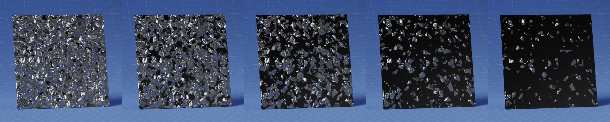
  <figcaption text-align="center"></figcaption>
</figure>

### Flake Normal

#### Distance

<figure>
  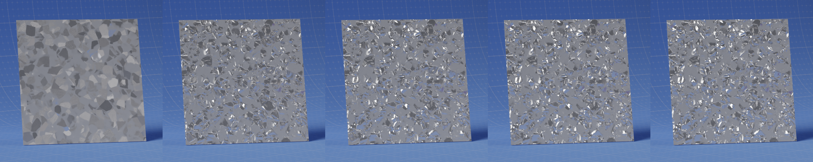
  <figcaption text-align="center"></figcaption>
</figure>

#### Roughness

<figure>
  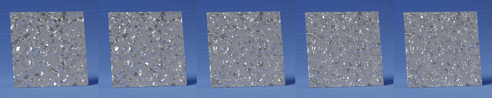
  <figcaption text-align="center"></figcaption>
</figure>

#### Variation

<figure>
  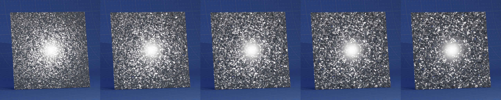
  <figcaption text-align="center"></figcaption>
</figure>

### Pearlescence

#### Weight

<figure>
  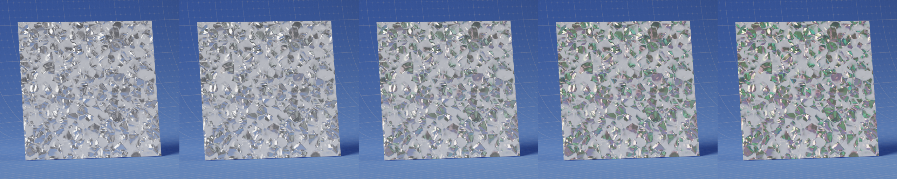
  <figcaption text-align="center"></figcaption>
</figure>

#### Thickness (nm)

<figure>
  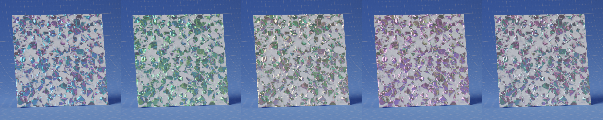
  <figcaption text-align="center"></figcaption>
</figure>

#### IOR

### Diffraction

#### Weight

<figure>
  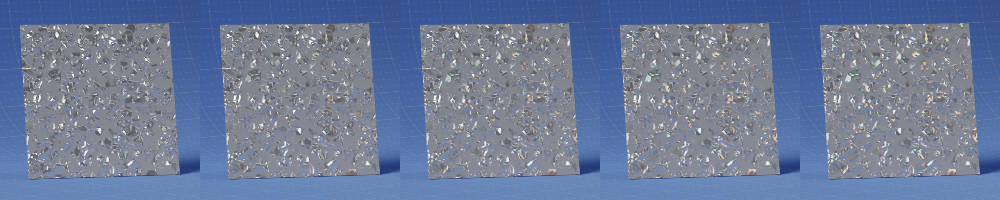
  <figcaption text-align="center"></figcaption>
</figure>

#### Spread

<figure>
  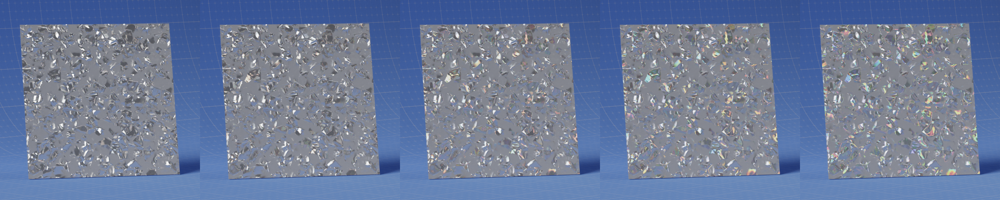
  <figcaption text-align="center"></figcaption>
</figure>

#### Tangent

<figure>
  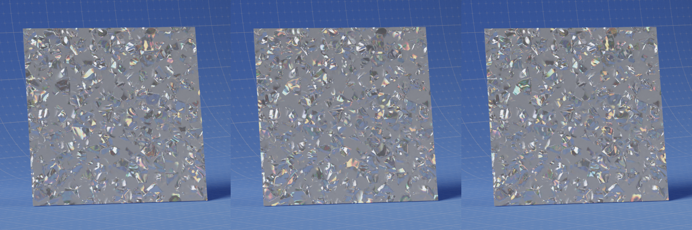
  <figcaption text-align="center"></figcaption>
</figure>

### Coat

#### Weight

<figure>
  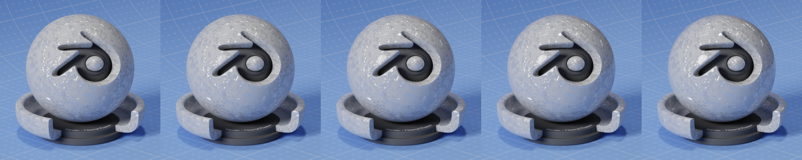
  <figcaption text-align="center"></figcaption>
</figure>

#### Roughness

<figure>
  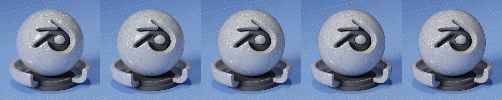
  <figcaption text-align="center"></figcaption>
</figure>

#### Tint

<figure>
  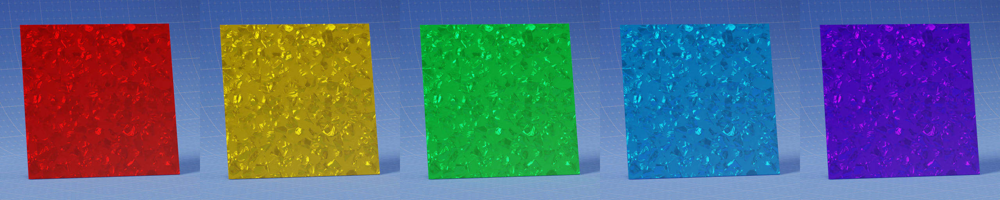
  <figcaption text-align="center"></figcaption>
</figure>

## Outputs

### Shader
Standard shader output.