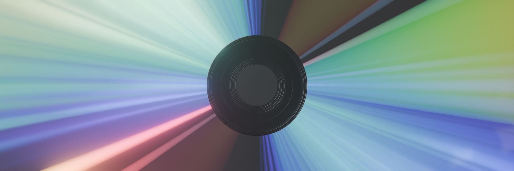

```{note}
Coming soon...
```

# Diffraction


When light encounters a grating (closely spaced lines or grooves) it diffracts, or bends. This creates a spectrum of colors as different wavelengths of light are scattered at different angles.